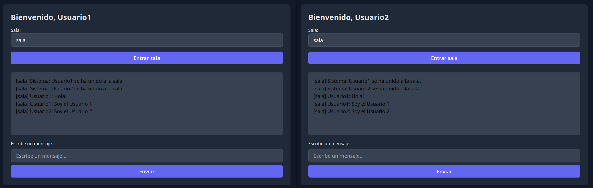

# ChatSignalR - Chat en tiempo real con ASP.NET Core y SignalR

---

## Índice  
1. [Descripción](#descripción)  
2. [Tecnologías](#tecnologías)  
3. [Requisitos](#requisitos)  
4. [Uso en local](#uso-en-local)

---

## Descripción  
Es una app de chat en tiempo real donde los usuarios pueden unirse a salas y hablar al instante. Hecha con ASP.NET Core y SignalR, con una interfaz moderna y sencilla de usar.

---



## Tecnologías  
- ASP.NET Core 7  
- SignalR  
- TailwindCSS  
- C#  
- JavaScript

---

## Requisitos  
- .NET 7 SDK o superior  

---

## Uso en local

```bash
git clone https://github.com/eaomarb/ChatSignalR.git
cd ChatSignalR
dotnet run
```

La aplicación estará disponible en [http://localhost:5022](http://localhost:5022) (o el puerto que indique la consola).

---
